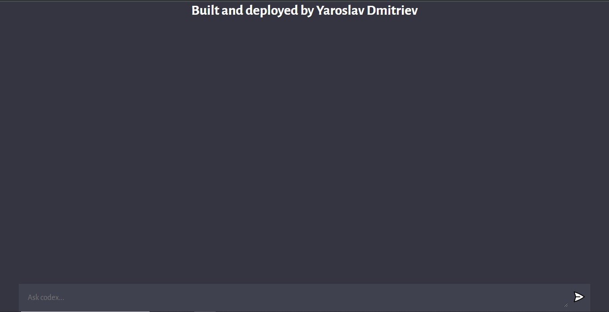

# Codex-ChatGPT

This project allows users to chat with GPT-3 and get answers to their questions. The best part is that there is no registration required to start chatting. 

## Table of Contents

- [Installation](#installation)
- [Usage](#usage)
- [Backend Dependencies](#backend-dependencies)
- [Frontend Dependencies](#frontend-dependencies)
- [Badges](#badges)

## Installation

1. Clone this repository to your local machine.
2. Install the required packages using `npm install` command in the root of the project.

## Usage

1. Run `node app.js` command in the root of the project.
2. Start chatting with GPT-3.

## Backend Dependencies

| Icon | Name | Version |
| --- | --- | --- |
|  | cors | ^2.8.5 |
|  | dotenv | ^16.0.3 |
|  | express | ^4.18.2 |
|  | nodemon | ^2.0.22 |
|  | openai | ^3.2.1 |

## Frontend Dependencies

| Icon | Name | Version |
| --- | --- | --- |
|  | vite | latest |

## Badges

The badges table above shows both the backend and frontend dependencies and their corresponding versions. The project is also powered by GPT-3 and there is a badge for that as well.
